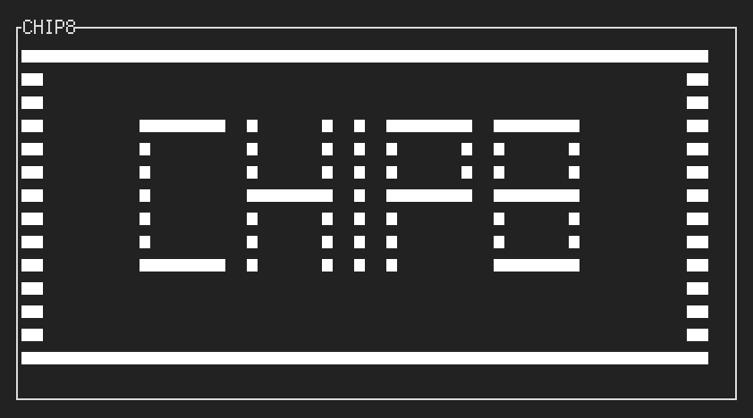

# TUI CHIP8
A CHIP8 emulator written in Rust that runs entirely in the terminal.

## Components
- Screen: TUI through [tui](https://docs.rs/tui/0.12.0/tui/)
- Keypad: [termion](https://docs.rs/termion/1.5.3/termion/) (dependency of tui)
- Sound: \x07 ASCII bell character (this is not at all portable but I couldn't resist)

## Compatibility
Compliance to CHIP8 specifications is tested carefully -- but compatibility is not guaranteed.
Fully passes opcode test ROM: see [corax89/test-rom](https://github.com/corax89/chip8-test-rom).
